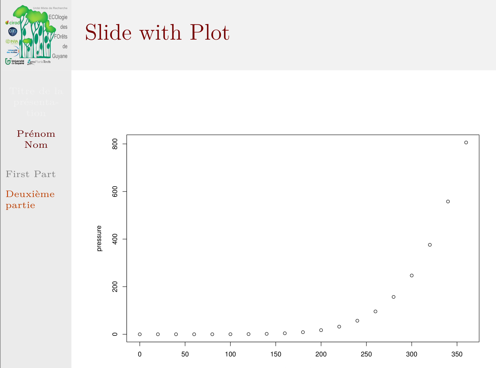
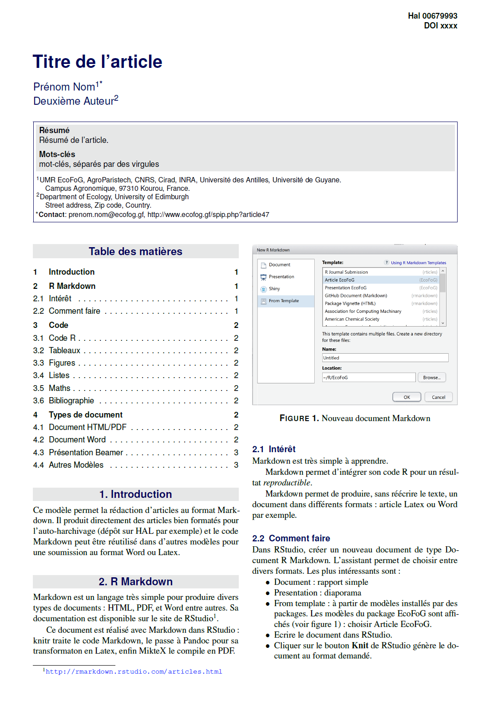
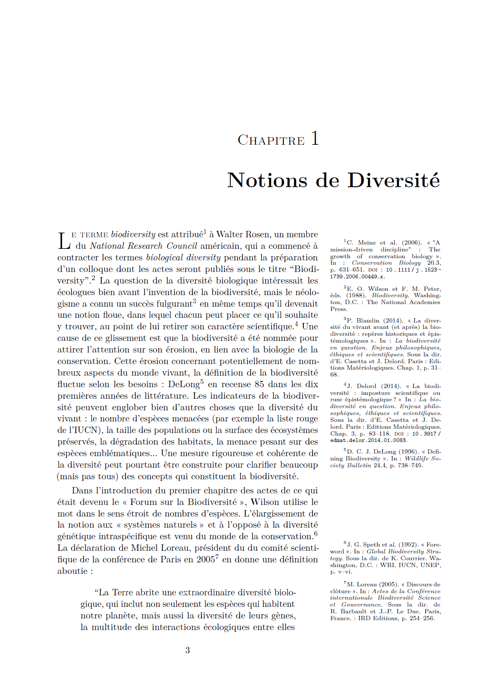

# EcoFoG

Utilitaires pour l'UMR EcoFoG

Contenu:

* Modèles 

  * modèle de présentation (R Markdown):

  
  * modèle d'article pour l'autoarchivage (R Markdown):

  *  Modèle d'ouvrage (Bookdown): livre, rapport, thèse. 

  
* Accès aux données Guyafor
