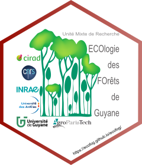

# EcoFoG 

Utilitaires pour l'UMR EcoFoG

## Contenu

* Modèles : ensemble de modèles utilisant la syntaxe de [bookdown](https://bookdown.org/yihui/bookdown/), qui permet la bibliographie, les références croisées, etc.

  * modèle de [présentation Beamer](https://ecofog.github.io/EcoFoG/Presentation/Presentation.pdf) (R Markdown) ou [HTML (ioslides)](https://ecofog.github.io/EcoFoG/Presentation/Presentation.html):

  
  * modèle d'[article](https://ecofog.github.io/EcoFoG/Article/introduction.html) pour l'autoarchivage (R Markdown):

  * modèle de [memo](https://ecofog.github.io/EcoFoG/Memo/introduction.html) au format simple (R Markdown):

  *  Modèle d'[ouvrage](https://ecofog.github.io/EcoFoG/Ouvrage/docs/index.html) (Bookdown): livre, rapport, thèse. 

  
* Accès aux données Guyafor
* Cartographie interactive de Paracou (`Automap()`)

## Vignette

Une vignette d'[introduction](https://ecofog.github.io/EcoFoG/) est disponible.
Dans R, utiliser la commande `vignette("EcoFoG", "EcoFoG")`.
