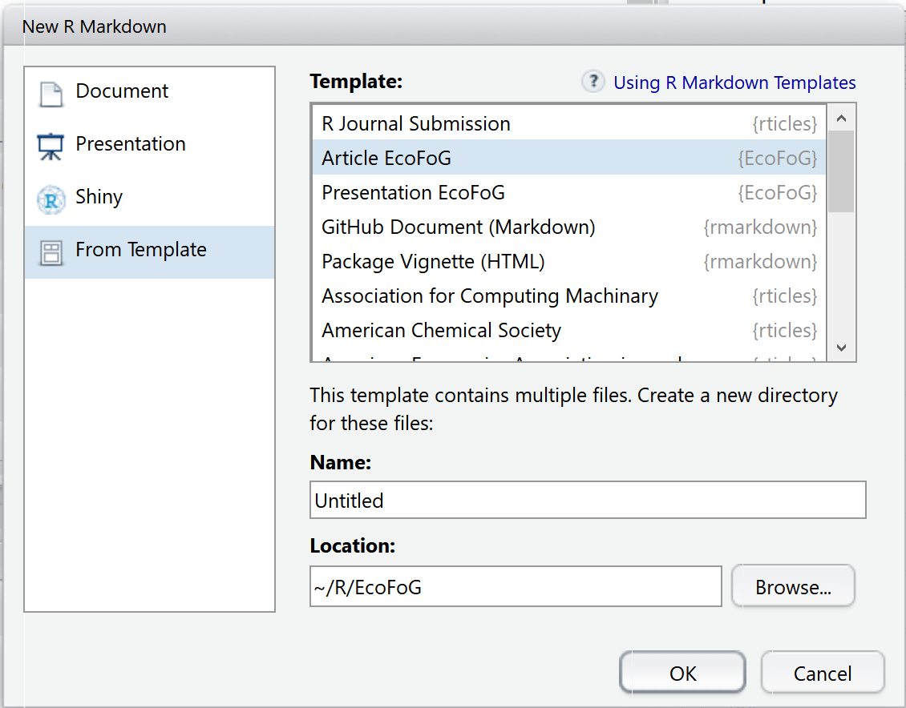

<!-- Options de knitr et de R (librairies, ...) --> 

```{r Options, echo=FALSE, message=FALSE}
knitr::opts_chunk$set(cache=TRUE, warning=FALSE, tidy=TRUE, tidy.opts=list(blank=FALSE, width.cutoff=40))
# Installation des packages si nécessaire et chargement
Library <- function(Packages) {
  InstallAndLoad <- function(Package) {
    if (!Package %in% installed.packages()[, 1]) {install.packages(Package)}
    require(Package, character.only = TRUE)
  }
  invisible(sapply(Packages, InstallAndLoad))
}
# Ajouter les packages nécessaires ici
# Library(c("entropart"))
```

<!-- Début du document ci-dessous --> 


# Introduction

Ce modèle permet la rédaction d'articles au format Markdown. 
Il produit directement des articles bien formatés pour l'auto-archivage (dépôt sur HAL par exemple) ou sous d'autres formats, par exemple HTML.

# R Markdown{#markdown}

Markdown est un langage très simple pour produire divers types de documents: HTML, PDF, et Word entre autres.
Sa documentation est disponible sur le site de RStudio[^1].

[^1]: <http://rmarkdown.rstudio.com/articles.html>


Markdown est étendu par Bookdown [^2], qui permet la rédaction de livres et une syntaxe plus efficace pour les articles.
Ce document est réalisé avec Markdown dans RStudio: knitr traite le code Markdown, le passe à Pandoc pour sa transformaton en Latex, enfin MikteX le compile en PDF.

[^2]: <https://bookdown.org/yihui/bookdown/>


## Intérêt

Markdown est très simple à apprendre.

Markdown permet d'intégrer son code R pour un résultat *reproductible*.

Markdown permet de produire, sans réécrire le texte, un document dans différents formats: article Latex ou Word par exemple.


## Comment faire

Dans RStudio, créer un nouveau document de type Document R Markdown. 
L'assistant permet de choisir entre divers formats. Les plus intéressants sont:

```{r nouveau, fig.cap="Nouveau document", echo=FALSE}

```

* Document: rapport simple

* Presentation: diaporama

* From template: à partir de modèles installés par des packages. Les modèles du package EcoFoG sont affichés (voir figure \@ref(fig:nouveau)): choisir Article EcoFoG.

* Ecrire le document dans RStudio.

* Cliquer sur le bouton **Knit** de RStudio génère le document au format demandé.


# Code

Les principales caractéristiques de Markdown sont résumées ici.


## Code R

Le code R est inclus dans des bouts de code (*code chunks*):

```{r cars, echo = TRUE}
head(cars)
```


## Tableaux

Les séparateurs horizontaux - et verticaux | permettent de dessiner un tableau.
Les tableaux peuvent aussi être produits par du code R, avec le package knitr:

```{r kable}
names(iris) <- c("Longueur sépales", "Largeur", "Longueur pétales", "Largeur", "Espèce")
knitr::kable(head(iris), caption="Tableau créé par R", longtable = TRUE, booktabs = TRUE)
```

Une légende est possible et le référencement aussi (tableau \@ref(tab:kable)).
Attention, la largeur des tableaux est limitée à une colonne de texte, et les retours à la ligne dans les cellules ne sont pas pris en charge. 


## Figures

```{r pressure, fig.cap="Titre de la figure"}
plot(pressure)
```

Les figures peuvent être créées par le code R (figure \@ref(fig:pressure)).
Avec Bookdown, une étiquette est associée à chaque figure: son nom est `fig:xxx` où `xxx` est le nom du bout de code R.
Les renvois se fonct avec la commande `\@ref(fig:xxx)`.

Une figure peut utiliser toute la largeur de la page en ajoutant les options suivantes dans l'entête du bout de code qui la génère: `fig.env="figure*"`et   `out.extra=""`.

Les figures existantes sont intégrées dans un bout de code par la fonction `include_graphics`, voir la figure \@ref(fig:nouveau).


## Listes

Les listes sont indiquées par des *, + et - (trois niveaux hiérarchiques) ou des nombres 1., i. et A. (listes numérotées). 

* Liste

    + sous-liste

* deuxième élément

* Suite de la liste


## Maths

Les équations au format Latex peuvent être insérées en ligne, comme $A=\pi r^2$ ou isolées comme $$e^{i \pi} = -1.$$

Elles peuvent être numérotées (voir équation \@ref(eq:disque)) en utlisant l'environnement _equation_ :

\begin{equation}
A = \pi r^2.
(\#eq:disque)
\end{equation}


## Références croisées

Les figures et tableaux ont une étiquette générée automatiquement, identique au nom du bout de code préfixé par `fig:` et `tab:`.

Pour les équations, l'étiquette est ajoutée manuellement par le code `(\#eq:xxx)` avant la fin de l'équation.

Les sections peuvent recevoir une étiquette en terminant leur titre par `{#yyy}`.

Des signets peuvent aussi être placés librement dans le texte avec la commande `(ref:zzz)`.

Dans tous les cas, l'appel à la référence est fait par la commande `\@ref(ref:zzz)`.


## Bibliographie

Les références bibliographiques incluses dans le fichier references.bib peuvent être appelées dans le texte, entre parenthèses [@Marcon2014c], ou dans le texte, à la façon de @Marcon2014c.

La bibliographie est traitée par Pandoc lors de la production de documents Word ou HTML.
Le sytle bibliographique peut être précisé, en ajoutant la ligne 

    csl:nom_du_fichier.csl
    
dans l'entête du document et en copiant le fichier de style _.csl_ dans le dossier du projet.
Plus d'un millier de styles sont disponibles [^1].

[^1]: https://github.com/citation-style-language/styles

Pour les documents PDF, la bibliographie est gérée par \LaTeX: c'est pourquoi l'extension _.bib_ du fichier doit être supprimée dans la déclaration de la base bibliographique.
Le style est inclus dans le modèle EcoFoG: c'est celui de _Methods in Ecology and Evolution_.
Il ne peut pas être changé, pour assurer l'homogénéité des documents produits.

Pour préparer la soumission d'un manuscrit à une revue, il faudra ouvrir le fichier _.tex_ intermédiaire produit par Pandoc et copier le contenu de l'environnement \{document\} dans le modèle proposé par la revue, qui se chargera du formatage.


# Types de document

Ce modèle est prévu pour fonctionner avec le modèle Article d'EcoFoG en LaTeX et produire des documents au format PDF.
En changeant l'entête du document, un fichier HTML est produit: décommenter 

     bookdown::gitbook

et commenter

    bookdown::pdf_book:

et les deux lignes suivantes qui en dépendent; compléter le nom du fichier _.bib_ avec son extension sur la ligne `bibliography` (LaTeX attend le nom du fichier sans extension contrairement aux autres générateurs).

Pour produire un document Word, procéder de la même façon que pour un fichier HTML en décommentant

    bookdown::word_document2.

Le document Word peut ensuite être modifié pour respecter les instructions aux auteurs des revues : double interlignage, police, etc.

## Document HTML/PDF

Pour un usage quotidien: le modèle HTML simple à utiliser, son format de sortie est propre correct. Le résultat est bien plus clair que du code R commenté.

## Document Word

Son contenu peut être mis en forme ou copié dans un modèle. 
Les styles de texte standard  sont "First Paragraph" et "Corps de de texte".

L'intérêt du format Word est de produire un manuscrit pour les revues qui ne supportent pas \LaTeX.
Le style bibliographique de la revue est très probablement disponible au format _.csl_, ce qui permet de minimiser la préparation manuelle.


## Présentation Beamer

Utiliser le modèle *Présentation EcoFoG* proposé par le package.

Le document produit est un diaporama Beamer respectant la charte graphique 2018.


## Autres Modèles

Le package rticle fournit des modèles d'articles (PLOS, PNAS, etc.). 
Le package xaringan fournit un modèle de présentation HTML 5.

Le modèle Ouvrage du package EcoFoG permet d'écrire des livres.

La dernière ligne du modèle (bout de code R) doit être conservée pour afficher le titre _References_ (à traduire éventuellement dans la langue du document) au format HTML.
Le titre de niveau 1 _Références_ doit être ajouté manuellement aux fichiers Word.

`r if (knitr:::is_html_output()) '# References {-}'`
