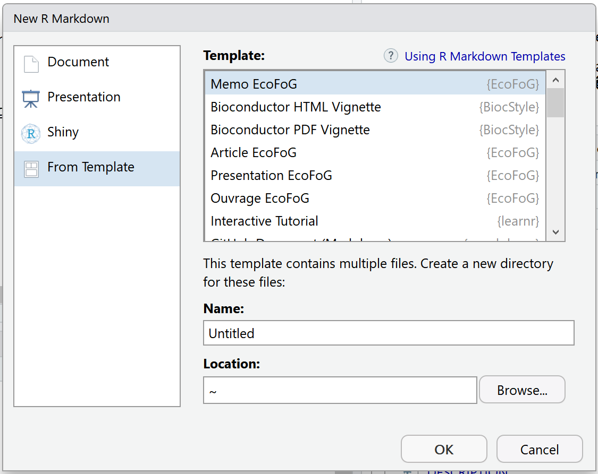

```{r Options, echo=FALSE, message=FALSE}
### knitr and R options (packages, ...)
knitr::opts_chunk$set(echo = FALSE, tidy=TRUE, tidy.opts=list(blank=FALSE, width.cutoff=50), out.width='.8\\maxwidth', fig.align='center')
options(width=50)
# Installation des packages si nécessaire et chargement
Library <- function(Packages) {
  InstallAndLoad <- function(Package) {
    if (!Package %in% installed.packages()[, 1]) {install.packages(Package, repos="https://cran.rstudio.com/")}
    require(Package, character.only = TRUE)
  }
  invisible(sapply(Packages, InstallAndLoad))
}
# Ajouter les packages nécessaires ici
Library(c("kableExtra"))
```


# Introduction

Ce modèle permet la rédaction de mémos au format Markdown. 
Il produit des documents PDF formatés simplement (une colonne, proche du modèle article de LaTeX) ou sous d'autres formats, par exemple HTML.

# R Markdown{#markdown}

Markdown est un langage très simple pour produire divers types de documents: HTML, PDF, et Word entre autres.
Sa documentation est disponible sur le site de RStudio[^1].

[^1]: <http://rmarkdown.rstudio.com/articles.html>


Markdown est étendu par Bookdown [^2], qui permet la rédaction de livres et une syntaxe plus efficace pour les articles.
Ce document est réalisé avec Markdown dans RStudio: knitr traite le code Markdown, le passe à Pandoc pour sa transformaton en LaTeX, enfin MikteX le compile en PDF.

[^2]: <https://bookdown.org/yihui/bookdown/>


## Intérêt

Markdown est très simple à apprendre.

Markdown permet d'intégrer son code R pour un résultat *reproductible*.

Markdown permet de produire, sans réécrire le texte, un document dans différents formats: article LaTeX ou Word par exemple.


## Comment faire

Dans RStudio, créer un nouveau document de type Document R Markdown. 
L'assistant permet de choisir entre divers formats.

```{r nouveau, fig.cap="Nouveau document", echo=FALSE}

```

Cliquer sur _From template_: à partir de modèles installés par des packages. 
Les modèles du package EcoFoG sont affichés (voir figure \@ref(fig:nouveau)): choisir Memo EcoFoG.

Ecrire le document dans RStudio.

Cliquer sur le bouton **Knit** de RStudio génère le document au format demandé.

Il est préférable de créer un projet RStudio pour bénéficier de toutes les possiblités : _File_ / _New Project_ puis utiliser l'assistant pour créer un projet à partir d'un dossier existant.


# Code

Les principales caractéristiques de Markdown sont résumées ici.


## Code R

Le code R est inclus dans des bouts de code (*code chunks*):

```{r cars, echo = TRUE}
head(cars)
```


## Tableaux

Les séparateurs horizontaux - et verticaux | permettent de dessiner un tableau selon la syntaxe de Markdown, mais ce n'est pas la meilleure méthode.

Les tableaux peuvent aussi être produits par du code R.
Le contenu du tableau est dans un dataframe.
La fonction `kable` du package _knitr_ prépare le tableau pour l'affichage et passe le résultat à la fonction `kable_styling` du package _kableExtra_ pour le formatage final.

```{r kable, echo=FALSE, warning=FALSE}
names(iris) <- c("Longueur sépales", "Largeur", "Longueur pétales", "Largeur", "Espèce")
knitr::kable(head(iris), caption="Tableau créé par R", longtable = TRUE, booktabs = TRUE) %>%
kableExtra::kable_styling(bootstrap_options = "striped", full_width = FALSE)
```

La légende est précisée par l'argument `caption` et le référencement est possible parce que le tableau reçoit une étiquette dont le nom est `tab:` suivi du nom du bout de code (tableau \@ref(tab:kable)).
Utiliser systématiquement l'argument `booktabs = TRUE` pour que l'épaisseur des lignes de séparation soit optimale en LaTeX.
L'option\break `bootstrap_options = "striped"` fournit des tableaux plus lisibles en HTML.

En LaTeX, Les tableaux peuvent avoir la largeur de la colonne et éventuellement d'étendre sur plusieurs pages\break `longtable = TRUE` ou bien utliser la largeur de la page\break `longtable = FALSE` comme le tableau \@ref(tab:Paracou)) (ce qui n'a pas d'effet sur un document formaté sur une seule colonne).

```{r Paracou, echo=FALSE, warning=FALSE}
Intervention <- data.frame(
  Treatment=c("Control", "T1", "T2", "T3"),
  Timber=c("", 
           "DBH $\\geq$ 50 cm, commercial species, $\\approx$ 10 trees/ha", 
           "DBH $\\geq$ 50 cm, commercial species, $\\approx$ 10 trees/ha",
           "DBH $\\geq$ 50 cm, commercial species, $\\approx$ 10 trees/ha"),
  Thinning=c("", 
             "", 
             "DBH $\\geq$ 40 cm, non-valuable species, $\\approx$ 30 trees/ha", 
             "DBH $\\geq$ 50 cm, non-valuable species, $\\approx$ 15 trees/ha  "),
  Fuelwood=c("", 
             "", 
             "", 
             "40 cm $\\leq$ DBH $\\leq$ 50 cm, non-valuable species, $\\approx$ 15 trees/ha"),
  AGBLost=c(0, "$[12\\%-33\\%]$", "$[33\\%-56\\%]$", "$[35\\%-56\\%]$")
)
names(Intervention)[5] <- "\\%AGB lost"
knitr::kable(Intervention, caption="Intervention table, summary of the disturbance intensity for the 4 plot treatments in Paracou.", longtable = FALSE, booktabs = TRUE, escape = FALSE) %>%
  kableExtra::kable_styling(bootstrap_options = "striped", full_width = TRUE)
```

Ce tableau contient des mathématiques : l'option\break `escape = FALSE` est nécessaire.

Enfin, l'option `full_width = FALSE` permet d'ajuster la largeur du tableau à son contenu au lieu d'occuper toute la largeur disponible.
Un bug de knitr fait que le format du tableau ("html") n'est pas transmis correctement à `kable_styling` lors du tricotage au format gitbook, ce qui génère un avertissement et empêche l'option d'être prise en compte.


## Figures

```{r pressure, fig.cap="Titre de la figure"}
plot(pressure)
```

Les figures peuvent être créées par le code R (figure \@ref(fig:pressure)).
Avec Bookdown, une étiquette est associée à chaque figure: son nom est `fig:xxx` où `xxx` est le nom du bout de code R.
Les renvois se fonct avec la commande `\@ref(fig:xxx)`.

Une figure peut utiliser toute la largeur de la page en ajoutant les options suivantes dans l'entête du bout de code qui la génère: `fig.env="figure*"` et\break `out.extra=""`.

Les figures existantes sont intégrées dans un bout de code par la fonction `include_graphics`, voir la figure \@ref(fig:nouveau).
Placer systématiquement ces fichiers dans le dossier `images` pour l'automatisation des pages GitHub.


## Listes

Les listes sont indiquées par des *, + et - (trois niveaux hiérarchiques) ou des nombres 1., i. et A. (listes numérotées). 

* Liste

    + sous-liste

* deuxième élément

* Suite de la liste


## Maths

Les équations au format LaTeX peuvent être insérées en ligne, comme $A=\pi r^2$ ou isolées comme $$e^{i \pi} = -1.$$

Elles peuvent être numérotées, voir équation \@ref(eq:disque), en utlisant l'environnement `\equation`:

\begin{equation}
A = \pi r^2.
(\#eq:disque)
\end{equation}


## Références croisées

Les figures et tableaux ont une étiquette générée automatiquement, identique au nom du bout de code préfixé par `fig:` et `tab:`.

Pour les équations, l'étiquette est ajoutée manuellement par le code `(\#eq:xxx)` avant la fin de l'équation.

Les sections peuvent recevoir une étiquette en terminant leur titre par `{#yyy}`.

Des signets peuvent aussi être placés librement dans le texte avec la commande `(ref:zzz)`.

Dans tous les cas, l'appel à la référence est fait par la commande `\@ref(ref:zzz)`.


## Bibliographie

Les références bibliographiques incluses dans le fichier references.bib peuvent être appelées dans le texte, entre parenthèses [@Marcon2014c], ou dans le texte, à la façon de @Marcon2014c.

La bibliographie est traitée par Pandoc lors de la production de documents Word ou HTML.
Le style bibliographique peut être précisé, en ajoutant la ligne 

    csl:nom_du_fichier.csl
    
dans l'entête du document et en copiant le fichier de style _.csl_ dans le dossier du projet.
Plus d'un millier de styles sont disponibles [^3].

[^3]: <https://github.com/citation-style-language/styles>

Pour les documents PDF, la bibliographie est gérée par LaTeX: c'est pourquoi l'extension _.bib_ du fichier doit être supprimée dans la déclaration de la base bibliographique.
Le style est inclus dans le modèle EcoFoG: c'est celui de _Methods in Ecology and Evolution_.
Il ne peut pas être changé, pour assurer l'homogénéité des documents produits.

Pour préparer la soumission d'un manuscrit à une revue, il faudra ouvrir le fichier _.tex_ intermédiaire produit par Pandoc et copier le contenu de l'environnement \{document\} dans le modèle proposé par la revue, qui se chargera du formatage.

## Table des matières

Une table des matières peut être ajoutée au début du document par l'option `toc:yes` dans l'entête du document.

## Préambule LaTeX

Des commandes LaTeX peuvent être ajoutées dans le préambule du fichier LaTeX produit, par exemple pour charger des packages supplémentaires.
Ces commandes sont dans la section `preamble:` de l'entête du fichier Markdown.

Les commandes par défaut permettent :

- d'utiliser le caractère degré (exemple: 20°C) :
```
\usepackage{textcomp}
\DeclareUnicodeCharacter{B0}%
  {\textdegree}
```

- de montrer l'utilisation de la commande de césure:
```
\hyphenation%
  {bio-di-ver-si-ty sap-lings}
```

D'autres commandes peuvent être ajoutées selon les besoins.
Attention :

- les commentaires ne sont pas possibles ;

- les commandes complexes (comme\break `\renewenvironment`) doivent être entrées sur une seule ligne sinon elles seront détruites par knitr au premier tricotage en HTML.


## Forçage des coupures de ligne

La césure est gérée automatiquement en LaTeX.
Si un mot n'est pas coupé correctement, ajouter son découpage dans le préambule du fichier avec la commande `\hyphenation` (les mots sont séparés par des espaces, les emplacement de césure représentés par des tirets).

Si LaTeX ne parvient pas à trouver de solution pour le retout à la ligne, par exemple pare que du code constitue un bloc insécable trop long, ajouter la commande LaTeX `\break` à l'emplacement du retour à la ligne.
Ne pas laisser d'espace avant la commande. 
Le document HTML ignore les commandes LaTeX.


# Types de document

Utiliser la liste de choix du bouton _Knit_ pour choisir le format de sortie.

## Document PDF

Le document est formaté comme le modèle article de LaTeX.

## Document HTML

Le modèle GitBook est optimisé pour la lecture sur écran.
Pendant toute l'écriture, préférer le tricot au format HTML pour sa vitesse d'exécution.
Un bouton de téléchargement est disponible dans la barre de menu du document: il fonctionnera si le document est aussi tricoté au format PDF et si le nom du fichier est rensigné dans le champ download de l'entête YAML.

Le modèle HMTL Book est une alternative.

## Document Word

Son contenu peut être mis en forme ou copié dans un modèle. 
Les styles de texte standard  sont "First Paragraph" et "Corps de de texte".

L'intérêt du format Word est de produire un manuscrit pour les revues qui ne supportent pas LaTeX.
Le style bibliographique de la revue est très probablement disponible au format _.csl_, ce qui permet de minimiser la préparation manuelle.


## Optimisation pour GitHub

Le projet peut être déposé sur github.

Le script R fourni, _GithubPages.R_, permet de publier facilement l'article dans les pages web associées au dépôt en déplaçant les fichiers HTML produit par le tricotage de l'article dans le dossier _docs_.

Il suffit ensuite d'activer les pages web du dépôt, d'adapter le fichier _README.md_ fourni (suivre ses instructions) et de le dupliquer dans le dossier _docs_.


## Autres Modèles

Le modèle d'article EcoFoG est plus élaboré, en double colonne, optimisé pour l'auto-archivage.

Le package _rticle_ fournit des modèles d'articles (PLOS, PNAS, etc.). 
Le package _xaringan_ fournit un modèle de présentation HTML 5.

Le modèle _Ouvrage_ du package EcoFoG permet d'écrire des livres.

La dernière ligne du modèle (bout de code R) doit être conservée pour afficher le titre _References_ (à traduire éventuellement dans la langue du document) au format HTML.
Le titre de niveau 1 _Références_ doit être ajouté manuellement aux fichiers Word.

`r if (!knitr:::is_latex_output()) '# References {-}'`
